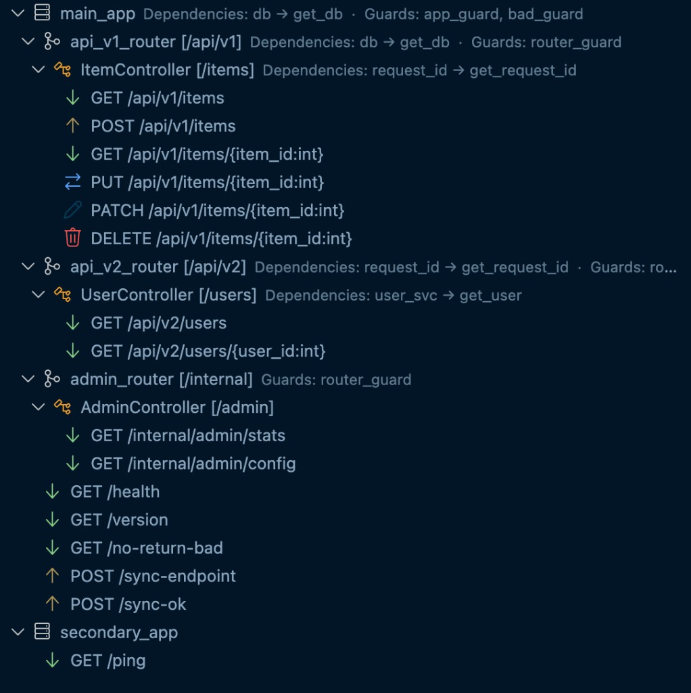
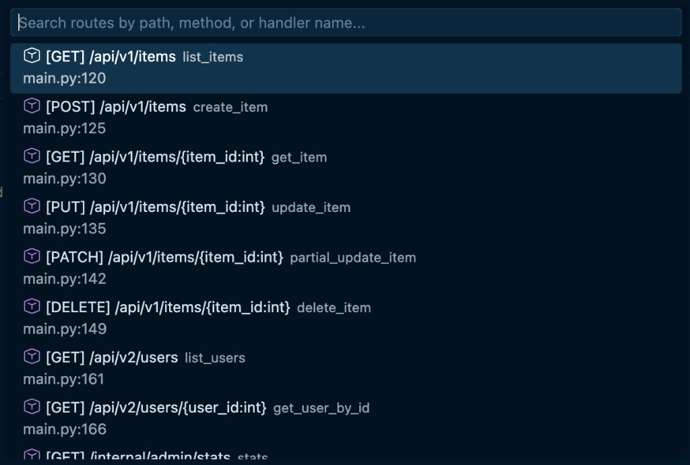
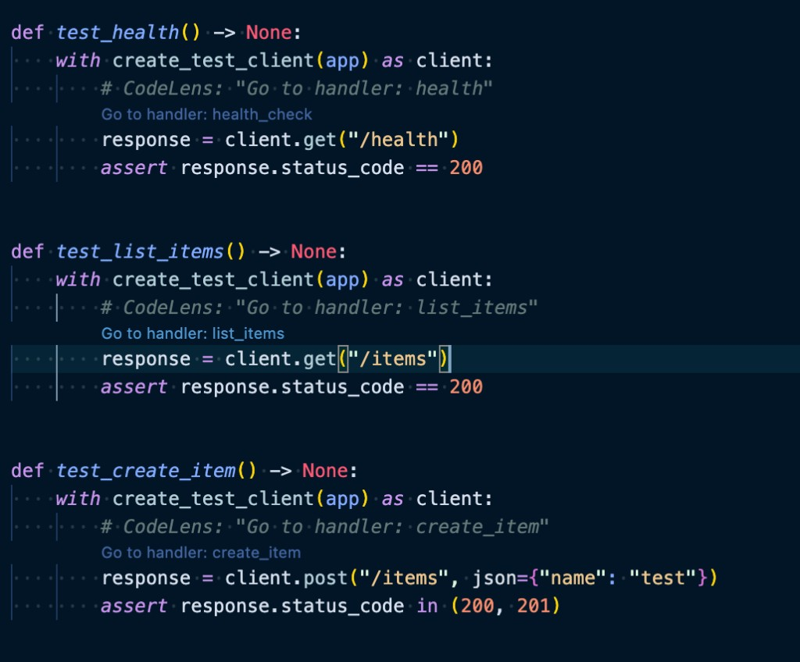

# Litestar for Visual Studio Code

A Visual Studio Code extension for [Litestar](https://litestar.dev/) framework development. Built on the Language Server Protocol with a Python backend for accurate static analysis.

[](https://marketplace.visualstudio.com/items?itemName=smirnoffmg.litestar)
[](https://opensource.org/licenses/MIT)

## Features

### Route Explorer

Hierarchical tree view of all routes in your Litestar application. Displays the full routing structure — `Litestar` app → `Router` → `Controller` → handler — with HTTP method, path, and handler type indicators. Dependencies and guards are shown inline for each node. Click any route to jump directly to its definition.



### Route Search

Quickly search across all routes by path, HTTP method, handler name, or controller using `Ctrl+Shift+E` (`Cmd+Shift+E` on Mac).



### CodeLens for Test Client

CodeLens links appear above test client calls like `client.get("/items")` using Litestar's `TestClient` or `create_test_client`, letting you jump directly to the matching route handler definition. Each link shows the handler name (e.g. "Go to handler: list_items"); click to jump to the route.



To try it: open [docs/codelens_test_example.py](docs/codelens_test_example.py) in a Litestar workspace with the extension enabled and look for the links above each `client.get(...)` / `client.post(...)` line.

### Diagnostics

Static analysis warnings for common Litestar issues:

- Handler missing return type annotation
- Sync handler without `sync_to_thread` parameter
- Duplicate route paths
- Guard function with incorrect signature
- `Provide(...)` referencing a non-existent callable
- Handler parameter not matching any path, query, or dependency source

### Dependency Injection Visualization

Hover over a handler to see its resolved dependency chain across all layers (app → router → controller → handler). Navigate from a handler parameter directly to its `Provide(...)` definition. Warnings for shadowed dependencies.

<!-- TODO: Add GIF/screenshot of DI visualization -->

### Guard Chain Visualization

View the full cumulative guard chain that applies to any handler, aggregated across all layers of the application.

### Snippets

| Prefix          | Description                                         |
| --------------- | --------------------------------------------------- |
| `ls-get`        | Scaffold a `@get()` handler with type hints         |
| `ls-post`       | Scaffold a `@post()` handler                        |
| `ls-put`        | Scaffold a `@put()` handler                         |
| `ls-patch`      | Scaffold a `@patch()` handler                       |
| `ls-delete`     | Scaffold a `@delete()` handler                      |
| `ls-controller` | Scaffold a `Controller` class with path and methods |
| `ls-router`     | Scaffold a `Router` with dependencies and guards    |
| `ls-guard`      | Scaffold a guard function                           |
| `ls-middleware` | Scaffold an ASGI middleware                         |
| `ls-test`       | Scaffold a test using `create_test_client`          |

## Requirements

- VS Code 1.64.0 or greater
- Python 3.9 or greater
- [Python extension](https://marketplace.visualstudio.com/items?itemName=ms-python.python) for VS Code

## Settings

| Setting                        | Description                                                                                                         | Default            |
| ------------------------------ | ------------------------------------------------------------------------------------------------------------------- | ------------------ |
| `litestar.entryPoint`          | Entry point for the Litestar application in module notation (e.g., `my_app.main:app`). Auto-detected if not set.    | `""` (auto-detect) |
| `litestar.args`                | Additional arguments passed to the Litestar language server.                                                        | `[]`               |
| `litestar.path`                | Path to a custom Litestar tool binary.                                                                              | `[]`               |
| `litestar.importStrategy`      | Defines how the extension finds the tool. `fromEnvironment` uses the Python environment, `useBundled` uses bundled. | `useBundled`       |
| `litestar.interpreter`         | Path to the Python interpreter to use.                                                                              | `[]`               |
| `litestar.codeLens.enabled`    | Show CodeLens links above test client calls.                                                                        | `true`             |
| `litestar.diagnostics.enabled` | Enable static analysis diagnostics for Litestar-specific issues.                                                    | `true`             |
| `litestar.showNotification`    | Controls when notifications are shown: `off`, `onError`, `onWarning`, `always`.                                     | `off`              |

The extension automatically discovers your Litestar app by scanning for files that instantiate `Litestar(...)`. If auto-detection doesn't work for your project structure, specify an entrypoint via the `litestar.entryPoint` setting or `[tool.litestar]` in `pyproject.toml`.

## Commands

| Command                    | Description                       |
| -------------------------- | --------------------------------- |
| `Litestar: Restart Server` | Restart the language server       |
| `Litestar: Show Routes`    | Open the Route Explorer panel     |
| `Litestar: Search Routes`  | Search routes via Command Palette |

## Architecture

The extension has two parts:

- **TypeScript** — handles VS Code integration: tree views, CodeLens UI, commands, status bar, settings management
- **Python** — language server built on [pygls](https://github.com/openlawlibrary/pygls) that performs AST-based static analysis of Litestar applications: route discovery, dependency resolution, guard chain analysis, and diagnostics

Communication between the two happens over the [Language Server Protocol](https://microsoft.github.io/language-server-protocol).

## Development

### Prerequisites

- Python 3.9+
- Node.js >= 18.17.0
- npm >= 8.19.0

### Setup

```bash
git clone https://github.com/<your-username>/litestar-vscode.git
cd litestar-vscode
python -m venv .venv
source .venv/bin/activate  # or .venv\Scripts\activate on Windows
pip install nox
nox --session setup
npm install
```

### Build and Run

Run the `Debug Extension and Python` launch configuration in VS Code (`F5`). This builds and launches the extension in a new Extension Development Host window.

To build without debugging: `Ctrl+Shift+B`.

### Debugging

| Configuration                | Use case                                       |
| ---------------------------- | ---------------------------------------------- |
| `Debug Extension and Python` | Debug both TypeScript and Python (recommended) |
| `Debug Extension`            | Debug TypeScript only                          |
| `Python Attach`              | Attach to a running `lsp_server.py` process    |

When stopping a combined debug session, stop both the TypeScript and Python sessions to ensure clean reconnection.

### Testing

```bash
# Run all tests
nox --session tests

# Run linting
nox --session lint
```

Test files are located in `src/test/python_tests/`. See `test_server.py` for the test structure.

### Pre-commit

Optional pre-commit hooks run lint and format checks on staged files before each commit:

```bash
pip install pre-commit
pre-commit install
```

Activate the project virtual environment before committing so Python hooks (e.g. pylint) can run, or install pre-commit in the same environment as the Python tools.

To run hooks on all files once (e.g. to align existing code with the config):

```bash
pre-commit run --all-files
```

### Logging

Logs are available in the `Output` panel under `Litestar`. Control the log level via `Developer: Set Log Level...` in the Command Palette.

For LSP message tracing, set `"litestar.server.trace": "verbose"` in your VS Code settings.

## Packaging and Publishing

```bash
nox --session build_package
```

Upload the generated `.vsix` to the [VS Code Marketplace](https://marketplace.visualstudio.com/manage), or publish via CLI:

```bash
npx vsce publish
```

See the [publishing guide](https://code.visualstudio.com/api/working-with-extensions/publishing-extension) for details.

## Contributing

Contributions are welcome! Please see [CONTRIBUTING.md](CONTRIBUTING.md) for guidelines.

## License

[MIT](LICENSE)

## Acknowledgements

- [Litestar](https://litestar.dev/) — the framework this extension supports
- [pygls](https://github.com/openlawlibrary/pygls) — Python language server library
- [VS Code Python Tools Extension Template](https://github.com/microsoft/vscode-python-tools-extension-template) — the foundation this extension is built on
